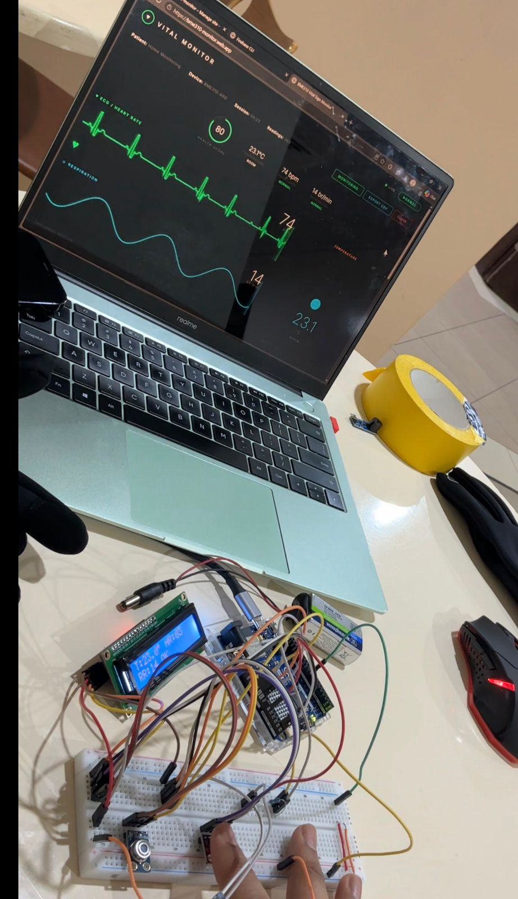
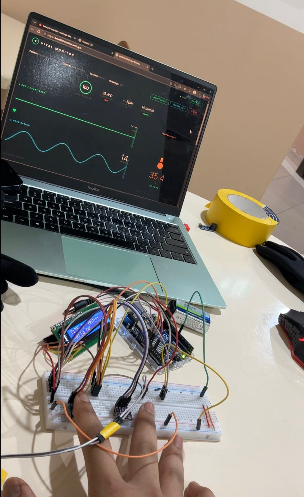
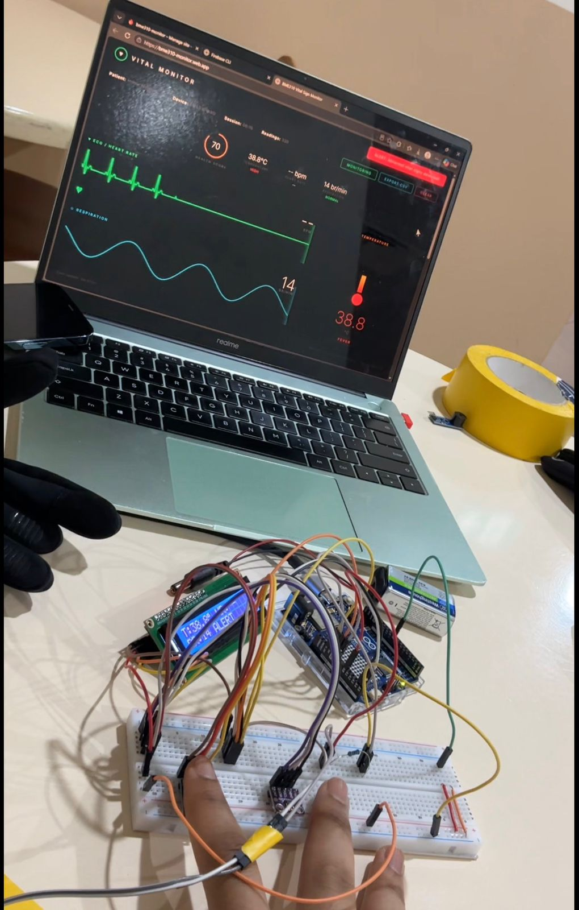
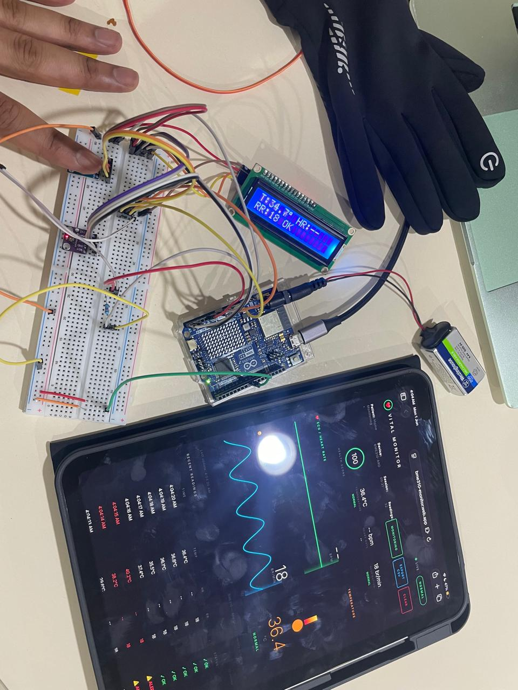
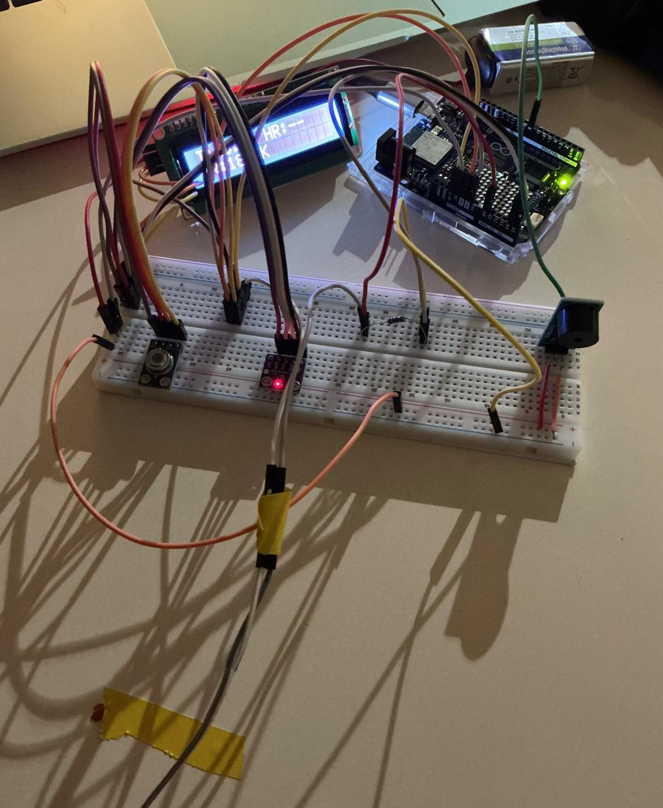

# VitalSync

A portable vital sign monitoring system that tracks temperature, heart rate, and respiration rate using low cost sensors. Readings show up on an LCD screen and get pushed to a cloud dashboard in real time. Anyone with the link can check the patient's vitals from their phone.

**Live Dashboard:** [monitor.web.app](https://bme310-monitor.web.app)

<p align="center">
  
  
</p>

## What It Does

The system reads three vital signs simultaneously and sends them to Firebase. A web dashboard picks up the data and renders animated waveforms that look like a hospital monitor. If any reading goes outside the safe range, a buzzer sounds and the dashboard turns red.

Two transmission modes are supported. The Arduino R4 WiFi can push data directly over WiFi for standalone battery powered operation. Alternatively, a Node.js script on a laptop reads the serial output and forwards it to Firebase, which avoids the 1.5 second SSL blocking that interferes with heart rate sampling.

<p align="center">
  
  
</p>

## System Architecture

```
                                    +----------+     +---------+
                                    | LCD 16x2 |     | Buzzer  |
                                    +----^-----+     +----^----+
                                         |                |
+-----------+                       +----+----------------+----+
| MLX90614  |---I2C (0x5A)---+      |                          |
+-----------+                |      |   Arduino Uno R4 WiFi    |
                             +----->|                          |
+-----------+                |      |   Signal Processing      |
| MAX30102  |---I2C (0x57)---+      |   Beat Detection         |
+-----------+                       |   Alert Logic            |
                                    +-----+----------+---------+
+-----------+                             |          |
| Flex 2.2" |---Analog (A0)--------------+          |
+-----------+                                  USB Serial
                                                    |
+----------+                              +---------v---------+
| 9V Batt  |---Vin-----------------------+|  Node.js Bridge   |
+----------+                              +---------+----------+
                                                    |
                                              HTTPS PUT/POST
                                                    |
                                          +---------v----------+
                                          |  Firebase Realtime |
                                          |  Database          |
                                          +---------+----------+
                                                    |
                                          +---------v----------+
                                          |  Web Dashboard     |
                                          |  (any browser)     |
                                          +--------------------+
```

## Hardware

<p align="center">
  
</p>

| Component | Model | Connection | What It Does |
|-----------|-------|------------|--------------|
| MCU | Arduino Uno R4 WiFi | | Runs the firmware and WiFi |
| Temp Sensor | MLX90614 (GY-906) | I2C, addr 0x5A, 3.3V | Infrared skin temperature |
| HR Sensor | MAX30102 | I2C, addr 0x57, 3.3V | PPG pulse detection |
| Resp Sensor | Flex 2.2" Spectra Symbol | Analog A0, 10k divider | Breathing motion |
| Display | LCD 16x2 I2C | I2C, addr 0x27, 5V | Local readout |
| Alert | Active buzzer 3 pin | Digital D8, 5V | Audible alarm |
| Power | 9V alkaline | Vin | About 3 hours runtime |

### Wiring

All three I2C devices share pins A4 (SDA) and A5 (SCL). No address conflicts since the LCD sits at 0x27, the MLX at 0x5A, and the MAX at 0x57. The flex sensor connects through a voltage divider to A0. The buzzer uses low level trigger logic on D8 (LOW = beep, HIGH = silent).

## Heart Rate Algorithm

The SparkFun library's built in beat detection does not work well with low LED power settings because the raw IR signal has a slow upward drift that masks the pulse peaks. VitalSync uses a derivative based approach instead:

1. Compute the difference between consecutive IR samples
2. Smooth it with a weighted average: `s = (3 * prev + diff) / 4`
3. When the smoothed value crosses above 40, mark a beat
4. Wait for it to drop below negative 10 before allowing the next beat
5. Throw out intervals outside 300 to 1500 ms (40 to 200 BPM)
6. Average the last 8 valid intervals for the displayed BPM

This removes the drift entirely because the derivative only responds to fast signal changes. Slow baseline movement produces a near zero derivative and gets filtered out.

## Dashboard

The dashboard is a single HTML file that connects to Firebase using the JavaScript SDK. It renders:

- Green ECG waveform with PQRST morphology timed to the actual BPM
- Blue sine wave for breathing that adjusts speed to match respiration rate
- Animated thermometer that changes color (blue for cold, orange for normal, red for fever)
- Health score from 0 to 100
- Scrolling table of the last 20 readings with color coded status
- CSV export button
- Responsive layout for phone and desktop

## Getting Started

### Set up Firebase

1. Go to [console.firebase.google.com](https://console.firebase.google.com)
2. Create a new project
3. Enable Realtime Database (set rules to test mode for development)
4. Go to Project Settings and register a web app
5. Copy the config object (apiKey, authDomain, databaseURL, etc.)
6. Paste your config into `dashboard/index.html` replacing the placeholder values
7. Paste your database URL into `bridge/bridge.js` replacing the placeholder

### Flash the firmware

Open `firmware/vital_monitor.ino` in Arduino IDE. Install these libraries from the Library Manager:

- Adafruit MLX90614
- SparkFun MAX3010x
- LiquidCrystal I2C

Select Arduino Uno R4 WiFi as the board and upload.

### Run the bridge

```bash
cd bridge
npm install
```

Open `bridge.js` and set the COM port to match your Arduino. Close the Arduino Serial Monitor (it locks the port), then:

```bash
node bridge.js
```

### Open the dashboard

Double click `dashboard/index.html` or visit the deployed version at [your-project.web.app](https://your-project.web.app).

## Alert Thresholds

| Vital | Low | High |
|-------|-----|------|
| Temperature | 30.0 C | 37.8 C |
| Heart Rate | 50 BPM | 120 BPM |
| Respiration | 8 br/min | 25 br/min |

The temperature thresholds account for skin surface readings being 2 to 3 degrees below core body temperature. A forehead reading of 34 C is normal.

## Limitations

- Heart rate needs about 15 seconds to stabilize after placing your finger
- The flex sensor produces very small signals when strapped to the body (2 to 4 ADC units vs 40+ when bent by hand)
- WiFi direct mode blocks the processor for 1.5 seconds per SSL request, which can miss heartbeats
- The 9V battery lasts about 3 hours, a rechargeable pack would be better for daily use
- Not a medical device, intended as a proof of concept only

## Future Work

- Switch to ESP32 for non blocking WiFi (hardware SSL acceleration)
- Add SpO2 using the MAX30102's red LED channel
- Clip on finger probe instead of flat sensor
- Longer flex sensor or chest impedance for better respiration detection
- Historical trend graphs on the dashboard
- MQTT instead of HTTP for lower latency

## License

MIT
